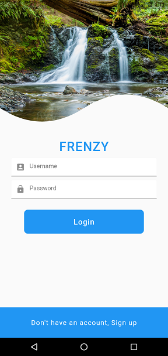
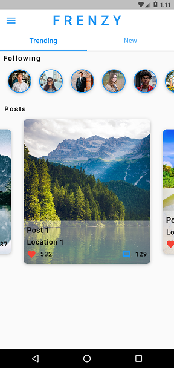
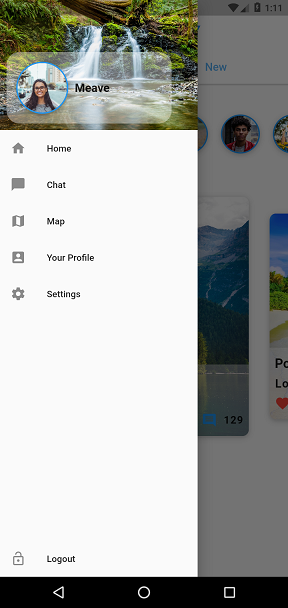
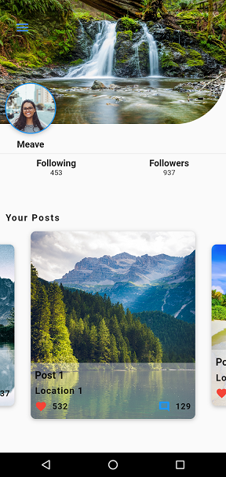

# FLUTTER SOCIAL APP UI 

Social App UI having Multiple screens, drawer, SliverAppbar, PageView , and Custom Clipper

# How to run:
` download the repo and install all the dependencies from pubspec.yaml then run`

## Screenshots

|Login|Home|
|----------------------|--------------------|
|||

|Drawer|Profile|
|----------------------|--------------------|
|||